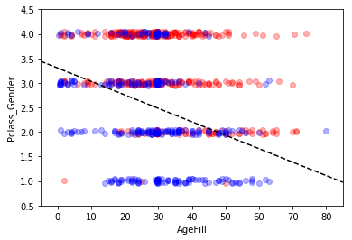

# 機械学習レポート

学習モデリングプロセスは以下の通り。

1. 問題設定
2. データ選定
3. データの前処理
4. 機械学習モデルの選定
5. モデルの学習（パラメータ推定
6. モデルの評価

## 第1章 線形回帰モデル

回帰とは、ある数値入力から連続値の出力を予測する問題である。 線形回帰は回帰問題を解くための機械学習モデルのひとつ。 入力と $$m$$ 次元パラメータの線型結合を出力する。

$$
\hat{y}=\mathbf{w}^\mathrm{T}\mathbf{x}+b
$$

データが複数あれば連立方程式を立てることができ、行列表現では以下のように書ける。

$$
\mathbf{y}=X\mathrm{w}+\mathbf{\varepsilon}
$$

ただし、$$X=(\mathbf{x}_1,\cdots,\mathbf{x}_n)^\mathrm{T}$$, $$\mathbf{\varepsilon}=(\mathbf{\varepsilon}_1,\cdots,\mathbf{\varepsilon}_n)^\mathrm{T}$$ であり、$$\mathbf{\varepsilon}$$ は回帰直面に加わる誤差とする。

パラメータの推定はデータとモデル出力の平均自乗誤差 (Mean Squared Error; MSE) をパラメータで微分し、0となる $$\mathbf{w}$$ の点を求めることで行われる。回帰係数の解は以下の式で与えられる。

$$
\hat{\mathbf{w}}=(X^\text{(train)T}X^\text{(train)})^{-1}X^\text{(train)T}\mathbf{y}^\text{(train)}
$$

### ハンズオン：ボストン住宅価格データ

データは `sklearn.datasets.load_boston` から取得できる。`boston` 変数に `load_boston` した場合、データを含むディクショナリが得られる。`boston['DESCR']` の中身は以下の通り。

```bash:
Boston House Prices dataset
===========================

Notes
------
Data Set Characteristics:  

    :Number of Instances: 506

    :Number of Attributes: 13 numeric/categorical predictive

    :Median Value (attribute 14) is usually the target

    :Attribute Information (in order):
        - CRIM     per capita crime rate by town
        - ZN       proportion of residential land zoned for lots over 25,000 sq.ft.
        - INDUS    proportion of non-retail business acres per town
        - CHAS     Charles River dummy variable (= 1 if tract bounds river; 0 otherwise)
        - NOX      nitric oxides concentration (parts per 10 million)
        - RM       average number of rooms per dwelling
        - AGE      proportion of owner-occupied units built prior to 1940
        - DIS      weighted distances to five Boston employment centres
        - RAD      index of accessibility to radial highways
        - TAX      full-value property-tax rate per $10,000
        - PTRATIO  pupil-teacher ratio by town
        - B        1000(Bk - 0.63)^2 where Bk is the proportion of blacks by town
        - LSTAT    % lower status of the population
        - MEDV     Median value of owner-occupied homes in $1000's

    :Missing Attribute Values: None

    :Creator: Harrison, D. and Rubinfeld, D.L.
```

まず、データを `pandas.DataFrame` に格納する。

```python:
df = DataFrame(data=boston.data, columns=boston.feature_names)
```

単回帰分析では `data = df.loc[:, ['RM']].values`（RMは住宅あたりの部屋の数）を、重回帰分析では `data2 = df.loc[:, ['CRIM, RM']].values`（CRIMは街の死罪発生率）を説明変数とし、目的変数にはどちらも `target = df.loc[:, 'PRICE'].values` を用いた。これらを `sklearn.linear_model.LinearRegression` で `fit` メソッドを用いて回帰係数と切片の値を求めた。


上図は住宅価格の予測値を横軸、予測値と真値の差（residual）を縦軸に取った図。単純なモデルながらこのデータセットに対しては概ねよく説明できていることがわかる。

## 第2章 非線形回帰モデル

複雑な非線形構造を内在する現象に対しては、非線形回帰モデリングを実施する。 方法のひとつに基底展開法と呼ばれるものがある。

$$
y_i=w_0+\sum^m_{j=1}w_j\phi_j(\mathbf{x}_i)+\varepsilon_i
$$

ここで $$\phi$$ は基底関数であり、多項式函数、ガウス型基底関数、スプライン関数、Bスプライン関数などがよく用いられる。未知パラメータは最小自乗法や最尤法により推定される。

複雑な関数をフィットするとき過学習 (overfitting) や、未学習 (underfitting) といった問題が見られることがある。過学習は正則化法で回避しうる。モデルの複雑さに伴って、その値が大きくなるペナルティ項を追加した上で最小化問題を解く。正則化項の係数である正則化パラメータはクロスバリデーションで選択する。

## 第3章 ロジスティック回帰モデル

回帰という名前がついているが、ある数値入力からクラスに分類する「分類問題」に用いられる。
線型結合の結果をロジスティック関数の入力とし、0以上1以下の値を出力する。出力は確率として解釈できる。ロジスティック関数（シグモイド関数とも）の形は以下の通り。

$$
\sigma(x)=\frac{1}{1+\exp(-ax)}
$$

シグモイド関数の微分は、自身で表現することが可能という便利な性質がある。

$$
\sigma^\prime=a\sigma(x)(1-\sigma(x))
$$

モデルの出力が $$Y=t$$ となる確率はベルヌーイ分布で表すことができる。

$$
P(Y=t|\mathbf{x})=p^t(1-p)^{1-t}
$$

パラメータ $$\mathbf{w}$$ は負の対数尤度関数を最小化するように推定される。

$$
E(w_0,\cdots,w_m)=-\log L(w_0,\cdots,w_m)=-\sum^n_{i=1}(t_n\log p_i+(1-t_n)\log(1-p_i))
$$

解析解を求めるのは困難なので勾配降下法 (Gradient descent) を用いて、反復学習によりパラメータを逐次的に更新していく。

分類タスクの評価指標としては以下の値がよく用いられる。

- 正解率
- 適合率
- 再現率
- F値

### ハンズオン：タイタニック（ロジスティック回帰）

Kaggleにて提供されているタイタニックデータセットに対してロジスティック回帰モデルを用いて乗客の生死分類予測問題を解く。まず初めに以下のようにして欠損値を平均値で補完した。

```python:
titanic_df['AgeFill'] = titanic_df['Age'].fillna(titanic_df['Age'].mean())
```

説明変数を `data1 = titanic_df.loc[:, ['Fare']].values` のようにしてチケット価格とし、目的変数を `label1 = titanic_df.loc[:, ['Survived']].values` のように生死フラグとする。`sklearn.linear_model.LogisticRegression` を用いてデータをフィットするとロジスティック回帰モデルを学習できる。

次に、特徴量エンジニアリングとして、

- 客室のランクが高い（`Pclass` が小さい）ほど生存率が高い
- 男性（`Gender==1`）より女性（`Gender==0`）の方が生存率が高い

という仮定のもと、新しく `titanic_df['Pclass_Gender'] = titanic_df['Pclass'] + titanic_df['Gender']` として特徴量を作成した。説明変数を `data2 = titanic_df.loc[:, ['AgeFill', 'Pclass_Gender']].values` として、目的変数を先ほどと同様に生死フラグとしてロジスティック回帰モデルをフィットした。説明変数の空間内で決定境界を図示すると次の図のようになる。



上記の一変数を用いた場合の評価指標と、二変数を用いた場合の評価指標は以下の通り。後者の方が精度よく分類できていることがわかる。

```bash:
             precision    recall  f1-score   support
          0       0.64      0.95      0.77       108
          1       0.74      0.20      0.31        71
avg / total       0.68      0.65      0.59       179

             precision    recall  f1-score   support
          0       0.83      0.77      0.80       110
          1       0.67      0.74      0.70        69
avg / total       0.77      0.76      0.76       179

```

## 第4章 主成分分析

多変量データの持つ構造をより少数個の指標にまとめる次元削減の手法。学習データの分散が最大になる方向への線形変換を求める。具体的には、線形変換に用いる係数ベクトルのノルムが1になる制約のもとラグランジュ未定乗数法を用いて変換後の分散が最大になる条件を求める。これは分散共分散行列の固有値・固有ベクトルを求めることに一致する。

## 第5章 アルゴリズム

- k近傍法 (kNN)
  - 分類問題のための機械学習手法
  - 近傍k個のデータのクラスラベルの中で最も多いラベルを割り当てる
  - kを大きくすると決定境界は滑らかになる
- k平均法 (k-means)
  - 教師なし学習のクラスタリング手法
  - 与えられたデータをk個のクラスタに分類する
  - まず、各クラスタ中心の初期値をランダムに設定する
    - 各データ点を中心との距離が最も近いクラスタに割り当てる。
    - そして、再度クラスタの重心を計算する。
    - 収束するまでこの処理を繰り返す。

## 第6章 Appendix

ただの参考文献なので省略。

## 第7章 サポートベクターマシン

学習ビデオが提供されていないので省略。

### ハンズオン：サポートベクターマシン

#### タイタニック

ロジスティック回帰と全く同様に欠損値補完と特徴量作成をした上で、`sklearn.svm.LinearSVC` を用いて二変数を説明変数としてモデルをフィットする。説明変数空間上での決定境界は以下の図のようになった。


二変数のみの単純なデータのため、ロジスティック回帰の場合と目立った違いは見られない。

#### MNIST

手書き数字データセットであるMNISTに対してSVMによる分類（SVC）を行なった。訓練データを56,000個全て用いてフィットしたところ、しばらく待っても終わらないため、訓練データの `fit` および、テストデータの `predict` にかかる時間を計測したところ以下のようになった。

|#samples|fit time [s]|predict time [s]|test accuracy [%]|
|--------|------------|----------------|-----------------|
|1000    |0.7         |7.6             |86.4             |
|2000    |1.9         |14.2            |88.9             |
|3000    |3.6         |19.0            |89.9             |
|5000    |8.3         |28.2            |90.8             |
|10000   |27.4        |46.1            |92.1             |

フィットにかかる時間はサンプル数に対して非線形に増加していることがわかる。また、ここで変化させているのは訓練データ数のみであり、テストデータ数は14,000個で固定している。にも関わらず `predict` にかかる時間も非線形に増加している。

#### IRIS Dataset

アヤメの種類を分類するデータセット IRIS dataset を用いてSVM（RBFカーネル）のハイパーパラメータを変えたときの決定境界の変化をみる。コストパラメータ $$C$$, RBFカーネルのパラメータ $$\gamma$$ の組み合わせに対して、決定境界を図示したもの、validation dataに対するaccuracyをプロットしたものは以下の通り。


ただし、$$C$$ はSVMが解く2次計画問題の式に現れ、$$\gamma$$ はRBFカーネルの式の中で現れる。

$$
\min_\beta\frac{1}{2}||\beta||^2+C\sum^N_{i=1}\xi_i
$$

$$
K(x,x^\prime)=\exp(-\gamma||x-x^\prime||^2)
$$

$$C$$ が小さいときは決定領域の中に多くの誤分類点を含んでいるが, $$C$$ が大きいときは誤分類点が少なくなるように決定領域が歪められている。また、$$\gamma$$ が小さいときの決定境界は比較的緩やかな形をしているが、$$\gamma$$ が大きいときの決定境界はデータ点周りに局在している。